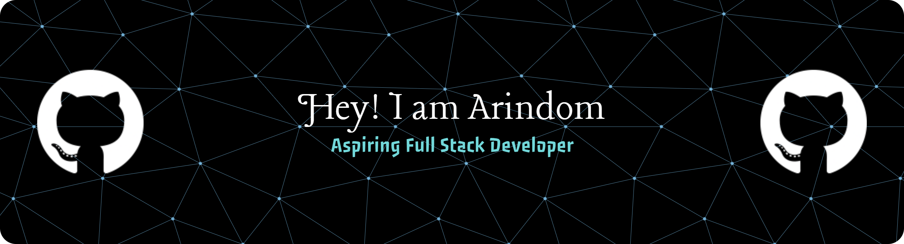

## About Me

I'm Arindom, an aspiring software developer interested in building practical solutions and exploring new technologies.

Currently, I'm focused on Full-Stack Development, Data Structures & Algorithms, and Cloud Computing. I enjoy participating in hackathons and collaborative projects, where I can apply what I learn to real-world problems.

I'm continuously improving my development and problem-solving skills through hands-on projects.

## Tech Stack

  

## Connect with Me

I'm always open to connecting with fellow developers, collaborating on projects, and discussing technology.

  

## Breakout

  <picture>
    <source
      media="(prefers-color-scheme: dark)"
      srcset="https://raw.githubusercontent.com/cyprieng/github-breakout/main/example/dark.svg"
    />
    <source
      media="(prefers-color-scheme: light)"
      srcset="https://raw.githubusercontent.com/cyprieng/github-breakout/main/example/light.svg"
    />
    
  </picture>

  

